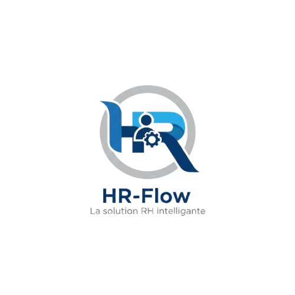

<p align="center">
	
</p>

# HR Flow

Plateforme RH developpee avec Symfony pour centraliser les processus de gestion des employes, recrutements, conges, formations et suivi interne.

## Apercu

HR Flow est un projet web collaboratif qui couvre plusieurs besoins metier RH:

- Authentification et gestion des roles
- 
- Recrutement et suivi des candidatures
-
- Gestion des conges et notifications
- Formation des employes
- Espace d'administration et tableaux de bord

## Stack Technique

- Backend: PHP 8+, Symfony 6.4
- ORM: Doctrine ORM + Doctrine Migrations
- Base de donnees: PostgreSQL (Docker)
- Frontend: Twig, Stimulus, Asset Mapper, Tailwind CSS
- Tests: PHPUnit

## Structure Principale

- `src/Controller`: Controleurs par domaine (Auth, Candidate, Dashboard, API, Admin)
- `src/Entity`: Entites Doctrine
- `src/Form`: Formulaires Symfony
- `src/Service`: Services metier
- `templates`: Vues Twig
- `migrations`: Migrations SQL/Doctrine
- `config`: Configuration Symfony
- `public`: Point d'entree web et assets publics

## Lancement En Local

### 1. Prerequis

- PHP 8+
- Composer
- Docker (pour PostgreSQL)

### 2. Installation

```bash
composer install
```

### 3. Variables d'environnement

Verifier le fichier `.env` et la variable `DATABASE_URL`.

### 4. Demarrer la base de donnees

```bash
docker compose up -d
```

### 5. Executer les migrations

```bash
php bin/console doctrine:migrations:migrate
```

### 6. Lancer le serveur

```bash
symfony server:start
```

Alternative sans Symfony CLI:

```bash
php -S 127.0.0.1:8000 -t public
```

## Tests

```bash
php bin/phpunit
```

## Alertes Taches Projet (Email)

Une commande envoie les alertes pour :

- taches en retard
- taches avec echeance a J+1

Commande manuelle :

```bash
php bin/console app:projects:send-task-reminders
```

Simulation sans envoi d'emails :

```bash
php bin/console app:projects:send-task-reminders --dry-run
```

Planification quotidienne a 08:00 :

- Linux (cron):

```bash
0 8 * * * cd /chemin/vers/Esprit-PIDEV-WEB--3A4-HrFlow && php bin/console app:projects:send-task-reminders
```

- Windows (Task Scheduler via schtasks):

```powershell
schtasks /Create /SC DAILY /ST 08:00 /TN "HrFlow Task Alerts" /TR "php C:\Users\BRAHIM\Desktop\Esprit-PIDEV-WEB--3A4-HrFlow\bin\console app:projects:send-task-reminders" /F
```

## Documentation Projet

- Kanban PI et suivi des taches: [docs/README.md](docs/README.md)
- Commandes GitHub Projects / Issues: [docs/PROJECTS_COMMANDS.md](docs/PROJECTS_COMMANDS.md)

## Equipe

Projet realise en equipe dans le cadre PIDEV.
